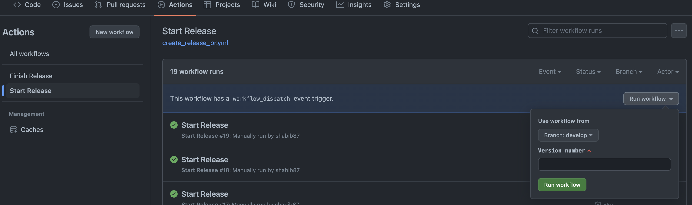

# GHA-Playground

## Release Workflow

This repo demonstrates and example of how to use a [manually triggered workflow](https://dev.to/this-is-learning/manually-trigger-a-github-action-with-workflowdispatch-3mga) that’ll take release number as input to publish release.

Select the `Start Release` action select `Run workflow`
| Screenshot  |
| ------------- |
|  |

This workflow will only run from develop branch, will skipped on others.

On version input, the workflow:

- checks out latest develop branch
- validates version input (if it's using semantic versioning: xx.xx.xx)
- runs unit tests
  - mocked for this example
- creates a release branch
- Updates translations
  - mocked by using mock_translation.json for this example
- uploads a relase build
  - mocked by using mock_build.json for this example
- commit the changes
- create a pull request to main

The repository has branch protection turned on for `main` as well as `auto-merge` ability turned on. On merge and push to `main` the final release workflow triggers:

- a tag is created from main with latest version release
- a github release is created
- develop branch is rebased with main
